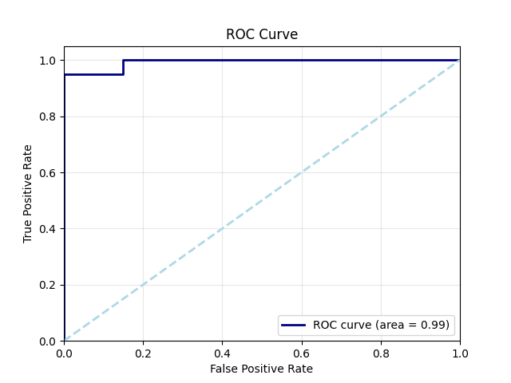
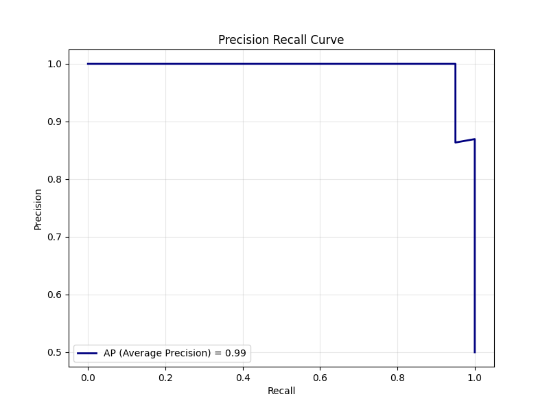
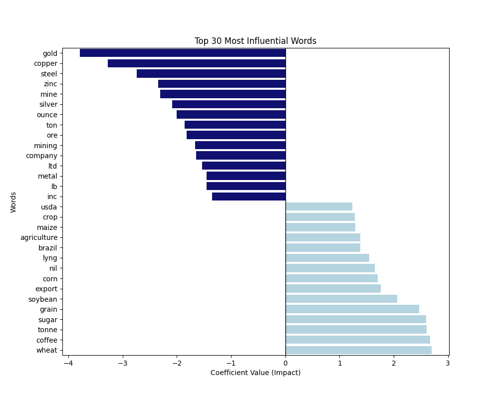

<br><div align="center">

# Binary Text Classification — NLP

### Classifying News Articles Using TF-IDF & Logistic Regression

<br>

[](https://www.python.org/)
[](https://scikit-learn.org/)
[](https://pandas.pydata.org/)
[](https://numpy.org/)
[](https://matplotlib.org/)
[](LICENSE)

<br>

> **98.1% Accuracy** on binary classification of Reuters news articles using a tuned Logistic Regression pipeline with TF-IDF features and 5-fold cross-validation.

<br>

</div>

---

## 🎯 Overview

This project implements a **binary text classification** pipeline to categorize Reuters news articles into two classes. The pipeline covers the full ML lifecycle — from raw text preprocessing and feature engineering to hyperparameter tuning and comprehensive model evaluation.

<table>
<tr>
<td width="50%">

### ✨ Features

- 🧹 **Text Preprocessing** — HTML/URL removal, lemmatization, stopword filtering
- 📊 **TF-IDF Vectorization** — Up to 5,000 features extracted from text
- 🔍 **Grid Search CV** — Exhaustive hyperparameter tuning with 5-fold cross-validation
- 📈 **Rich Evaluation** — ROC/PR curves, confusion matrix, feature importance
- 📝 **Prediction Export** — Full test set predictions saved to CSV

</td>
<td width="50%">

### 🏆 Results at a Glance

| Metric | Score |
|:---|:---:|
| **Accuracy** | `98.13%` |
| **ROC-AUC** | `0.99` |
| **Best C** | `10.0` |
| **Best Solver** | `liblinear` / `lbfgs` |
| **CV Folds** | `5` |
| **TF-IDF Features** | `5,000` |

</td>
</tr>
</table>

---

## 🏗️ Project Structure

```
binarytextclassificationNLP/
│
├── 📓 train.ipynb              # Main training notebook (end-to-end pipeline)
├── 📄 README.md
├── 📜 LICENSE                  # MIT License
│
├── 📂 data/
│   ├── trainset.txt            # Labeled training data (tab-separated)
│   └── testsetwithoutlabels.txt # Unlabeled test data
│
└── 📂 out/
    ├── 📂 cv/
    │   └── results.csv         # Grid search cross-validation results
    ├── 📂 plots/
    │   ├── roc_curve.png       # ROC curve plot
    │   ├── pr_curve.png        # Precision-Recall curve
    │   ├── confusion_matrix.png
    │   ├── feature_importance.png
    │   └── grid_search_heatmap.png
    └── 📂 pred/
        └── final_results_fixed.csv  # Predictions on the test set
```

---

## ⚙️ Pipeline


### 1️⃣ Text Preprocessing
- Remove HTML tags, URLs, punctuation, and numbers
- Convert to lowercase
- Remove stopwords and short words (length ≤ 2)
- Lemmatize tokens using WordNet

### 2️⃣ Feature Extraction
- **TF-IDF Vectorizer** with a vocabulary cap of **5,000 features**
- Fit on training data, transform applied to validation & test sets

### 3️⃣ Model Training & Tuning
- **Logistic Regression** with `GridSearchCV`
- Parameter grid:

  | Parameter | Values |
  |:---|:---|
  | `C` | `0.01`, `0.1`, `1.0`, `10.0` |
  | `solver` | `liblinear`, `lbfgs` |

- **5-fold stratified** cross-validation
- Best result: **C=10.0** with **98.13% CV accuracy**

### 4️⃣ Evaluation Suite
Comprehensive model evaluation including:
- Accuracy, Precision, Recall, F1-Score
- ROC Curve & AUC
- Precision-Recall Curve & Average Precision
- Confusion Matrix
- Log Loss
- Top 30 most influential words (feature coefficient analysis)

---

## 📊 Results

<div align="center">

### ROC Curve


<br><br>

### Precision-Recall Curve


<br><br>

### Top 30 Most Influential Words


</div>

---

## 🔬 Grid Search Results

| C | Solver | Mean CV Accuracy | Rank |
|:---:|:---:|:---:|:---:|
| 0.01 | liblinear | 69.38% | 7 |
| 0.01 | lbfgs | 51.25% | 8 |
| 0.1 | liblinear | 91.25% | 5 |
| 0.1 | lbfgs | 88.13% | 6 |
| 1.0 | liblinear | 97.50% | 3 |
| 1.0 | lbfgs | 97.50% | 3 |
| **10.0** | **liblinear** | **98.13%** | **🥇 1** |
| **10.0** | **lbfgs** | **98.13%** | **🥇 1** |

---

## 🚀 Getting Started

### Prerequisites

```bash
pip install numpy pandas matplotlib seaborn scikit-learn nltk
```

### Download NLTK Data

```python
import nltk
nltk.download('stopwords')
nltk.download('wordnet')
```

### Run

1. Clone the repository:
   ```bash
   git clone https://github.com/heyisula/binarytextclassificationNLP.git
   cd binarytextclassificationNLP
   ```

2. Open and run the notebook:
   ```bash
   jupyter notebook train.ipynb
   ```

3. Results will be saved to the `out/` directory.

---

## 📋 Data Format

### Training Data (`trainset.txt`)
Tab-separated with 4 fields:

```
<label> \t <title> \t <date> \t <body>
```

| Field | Description |
|:---|:---|
| `label` | `+1` (positive) or `-1` (negative) |
| `title` | Article headline |
| `date` | Publication date line |
| `body` | Full article body text |

### Test Data (`testsetwithoutlabels.txt`)
Tab-separated with 3 fields (no label):

```
<title> \t <date> \t <body>
```

---

## 🛠️ Tech Stack

<div align="center">

| Tool | Purpose |
|:---:|:---|
|  | **Python** — Core language |
|  | **Jupyter** — Interactive development |
|  | **NumPy** — Numerical computing |
|  | **Pandas** — Data manipulation |
|  | **scikit-learn** — ML models & evaluation |
| 📊 | **Matplotlib & Seaborn** — Visualization |
| 📝 | **NLTK** — Text preprocessing |

</div>

---

## 📄 License

This project is licensed under the **MIT License** — see the [LICENSE](LICENSE) file for details.

---

<div align="center">

**Made with ❤️ by [Isula Dissanayake](https://github.com/heyisula)**

⭐ Star this repo if you found it useful!

</div>